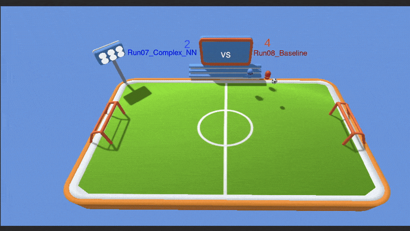
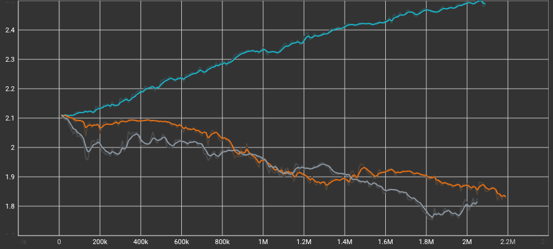
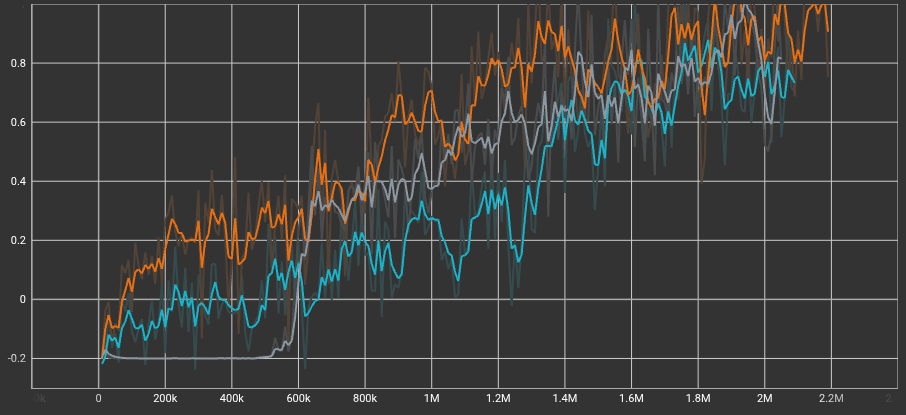
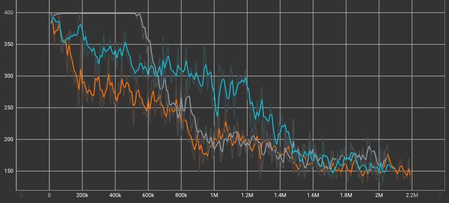

# Football RL: Unity ML-Agents

A custom 1v1 physics-based football environment where neural networks learn to play against each other using Reinforcement Learning (Proximal Policy Optimization). Built with Unity and the ML-Agents Toolkit.

## Table of Contents
* [The Project Overview](#the-project-overview)
  * [The AI Architectures](#the-ai-architectures)
  * [Training Metrics (TensorBoard)](#training-metrics-tensorboard)
* [Overcoming "Goalie Syndrome" (Reward Shaping)](#overcoming-goalie-syndrome-reward-shaping)
* [Features & Highlights](#features--highlights)
* [How to Run the Project](#how-to-run-the-project)
  * [Prerequisites](#prerequisites)
  * [Setup](#setup)

  ---

## The Project Overview
This project was designed to test the limits of self-play reinforcement learning in a continuous, physics-heavy environment. The agents control physical rigidbodies and must learn to navigate, jump, kick, and defend without any hardcoded behavior trees or state machines.

### The AI Architectures
Through iterative training, this project features two distinct "Brains" (neural networks) that evolved completely different playstyles:

* **The Baseline (Run 08):** A lightweight `2-layer, 256-hidden-unit` network. It plays a highly aggressive, fast-paced game, relying on quick reactions and pure speed to score.
* **The Big Brain (Run 07):** A massive `3-layer, 512-hidden-unit` network. This agent learned complex spatial geometry, long-term planning, and plays a highly defensive, strategic game. 
* **The Wildcard (Run 09) :** An experiment with high-entropy hyperparameter tweaks (`beta: 0.015`, `gamma: 0.995`) on smaller networks to create unpredictable "trickster" agents.

### Training Metrics (TensorBoard)
To verify the impact of the different network sizes and hyperparameter tweaks, the agents' training sessions were tracked and compared using TensorBoard.

**Entropy (Exploration vs. Exploitation)**
> *Notice how the Wildcard (teal line) exhibits a steadily increasing entropy curve throughout the training session, peaking near 2.5. In contrast, both the Big Brain (orange line) and the Baseline (grey line) show a steady decrease in entropy, gradually dropping below 1.9. This confirms that the hyperparameter tweaks successfully forced the Wildcard to maintain high exploration and unpredictable gameplay.*

**Cumulative Reward**
> *The Big Brain (orange line) establishes an early lead in cumulative reward and maintains the highest overall performance throughout most of the training. Interestingly, the Baseline (grey line) struggles initially, staying flat near -0.2 until around 600k steps, before rapidly learning and catching up to the others. The Wildcard (teal line) shows a more gradual, consistent learning curve than the Baseline but generally plateaus slightly lower than the Big Brain.*

**Episode Length**
> *As the agents become more highly skilled, the average episode lengths for all three models decrease significantly, starting near 400 and converging around 150 by the end of training. The Baseline (grey line) maintained the maximum episode length for the first 600k steps before finally figuring out how to score, which perfectly aligns with its delayed spike in cumulative reward. Meanwhile, the Big Brain (orange line) learned to conclude episodes much faster early in the training process.*

## Overcoming "Goalie Syndrome" (Reward Shaping)
One of the biggest challenges in this environment was overcoming the **Nash Equilibrium**—where agents realized that defending their own goal yielded a mathematically safer reward (`0.0`) than risking a midfield tackle (`-1.0`). 

To force the agents out of their nets, the environment utilizes a highly balanced, multi-tiered reward system:
* **Extrinsic Reward:** `+1.0` for scoring, `-1.0` for being scored on.
* **The Existential Penalty:** A constant `-0.0001` bleed per FixedUpdate frame. Standing still is no longer safe; agents are forced to push for the win before they bleed out.
* **Forward Progress:** `+0.001` for moving the ball aggressively toward the opponent's side.
* **Tight Aura Radius:** A `0.75` unit proximity reward that forces agents to physically touch the ball rather than farming points from a distance.

## Features & Highlights
* **Parallel Training:** Designed with isolated environment prefabs, allowing 10+ matches to simulate simultaneously to accelerate PyTorch data collection.
* **World-Space 3D UI:** Custom, team-colored scoreboards anchored dynamically to the physical goal nets.
* **Vector Observations:** Agents process the game using pure numerical data (X, Y, Z coordinates, Rigidbody velocities, and directional vectors to the ball) rather than computationally expensive visual pixel data.

## How to Run the Project

### Prerequisites
* Unity Editor (2022.3)
* Python 3.7.16
* [Unity ML-Agents Toolkit (Release 20 / v0.28.0)](https://github.com/Unity-Technologies/ml-agents)

**Core Python Dependencies:**
* `mlagents==0.28.0`
* `torch==1.7.1+cpu`
* `numpy==1.21.6`
* `tensorboard==2.11.2`

*Note: A full list of dependencies is available in the `requirements.txt` file. To install them, run `pip install -r requirements.txt` inside a Python 3.7 environment.*

### Setup
1. Clone this repository.
2. Open the project in Unity.
3. Open the `MainScene`.
4. In the Project window, navigate to `Assets/` and find the trained `.onnx` model files.
5. Select the `Player` objects (Team Blue and Team Red) in the hierarchy.
6. Drag the `.onnx` file into the **Model** slot of their `Behavior Parameters` component.
7. Hit **Play** in the Unity Editor to watch the AI battle it out!

